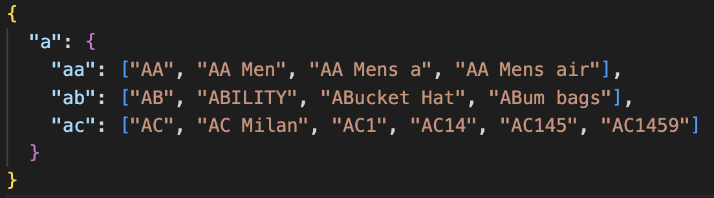

# Autocomplete-api

This project is a simple autocomplete API. It takes an input query and provide suggested queries, based on the value of input parameter  

To facilitate the search process, the data from CSV file is loaded with the following format :  
  

## Available Scripts

In the project directory, you can run the following scripts after installing the required dependencies with **yarn install**

### `yarn build`
Builds the app for production to the `build` folder. 

### `yarn run start:dev`

Runs the app in the development mode. 
Open [http://localhost:3000](http://localhost:3000) to view it in the browser. 
The number of the port can be changed by setting the `PORT` environment variable. 

The page will reload if you make edits. 

### `yarn run start`
You can also run the app in the production mode by running this script. 

### `yarn build:docker`
Builds the app for production to the `build` folder and creates a Docker image. 

### `yarn start:docker"`
Start the the prebuilt docker image on port 3000. 

 
